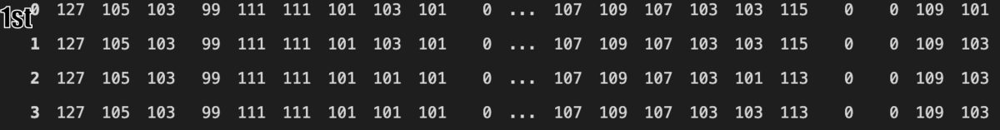

# Anomaly Detection in Petroleum Pipelines 🛢️

## Problem 🎯
Detect the **position** of anamolies in petrol pipelines using data generated from a maintainance device called "Pig" that travels inside the pipeline.
- Detecting **Wielding**
- Visualising **Metal loss** and or dents

### About Data 📋
- Data is in **binary** format saved in - 'captured_data.bin' file, captured from 84 sensors for 50_000 milliseconds
- Pigs directly captured/store data in `binary(.bin)` format

### Data Analysis Insights with Understanding 📈
- Data varies with time i.e., **Time Series data**
- We can also see a **repeated pattern** of **flux** at times in all sensors.
   
### Techniques 🛠️
- **Normalised** data for comparision purpose.
- **Aggregated(sum)** all sensors to amplify anamoly.
- The **z-score** method is effective here with comparision to *Inter-Quartile Range* method as per the observations.
- Edge detection using **Sobel**, OpenCV.

### Different Approaches Used 🔄
- [x] Approach 1: Using Various Statistical methods like InterQuartile Range, Z-score, etc.     
- [x] Approach 2: By Filtering anamolies with Sobel Derivatives,Image Processing in OpenCV.

[Approach 1](Notebooks/anamoly-detection.ipynb) | [Approach 2](Notebooks/anamoly-detection-using-image.ipynb)

## Output 📄

|Pipe | Number|Outlier Position|
|-----|-------|----------------|
|0 | 0 | 624 |
|1 | 0 | 678 |
|2 | 1 | 5070 |
|3 | 1 | 5117 |
|4 | 1 | 8252 |
|5 | 1 | 8286 |
|6 | 2 | 11397 |
|7 | 2 | 14990 |
|8 | 3 | 15001 |
|. | . | ... |
|. | . | ... |
|. | . | ... |

## Conclusion 📝
We can detect position of wielded iron and also visualise the metal loss.

> ### Little Business Understanding
> - Many pipes are wielded together to form a pipeline.
> - Pigging is a concept in pipeline maintenance that involves the use of devices known as pigs, which clean pipelines and are capable of checking pipeline condition from inside.
> - Pigs inspects pipelines by receiving magnetic flux from the walls of the pipe.
> - Applications of Pigging include oil & gas, lube oil, chemical plants and hygienic applications such as pharmaceutical or food, etc.

> 

> 

> - Each "Pig"(here) has 84 sensors in circumference that captures data every millisecond while travelling in pipes. So this becomes a `time series problem` where each traversal time for each independent pipe is 5_000 milliseconds.
###### Tribute @my Mentor Hasan Ali 🙏

Connect with Me
Feel free to reach out or check out my other projects
[LinkedIn Demo](https://www.linkedin.com/feed/update/urn:li:activity:6688042267397238784/)

