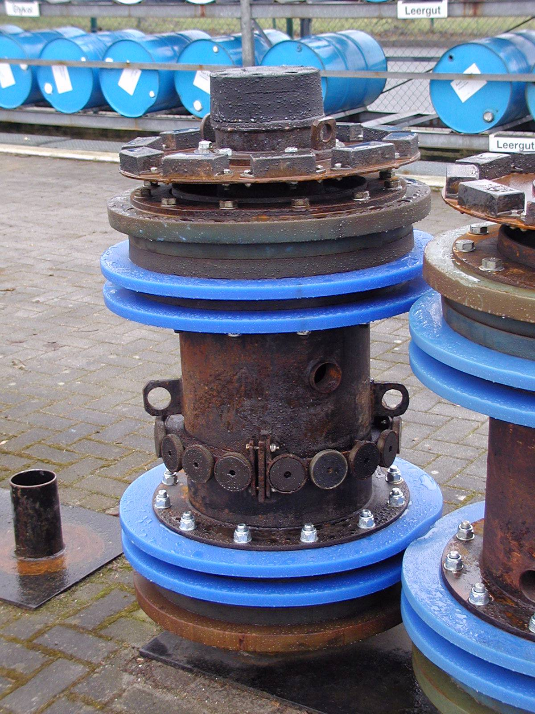
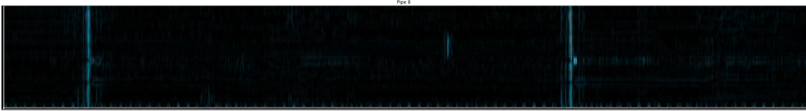
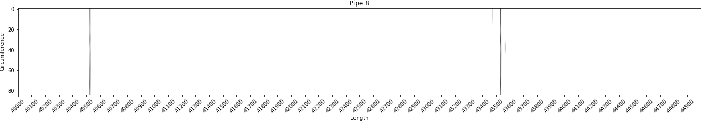

# Anamoly-Detection-Petroleum
 Data Science Project to detect the position of anamolies/flaws/metal loss in petrol pipelines(each pipe) using data provided by a device called "Pig" that travels inside the pipes.

 ## Problem
Detect the position of anamolies/flaws in petrol pipelines(each pipe) using a device called "Pig" that travels inside the pipes.
    - Detecting Wielding
    - Detecting Metal loss and or dents 

### Business Understanding
    - A long Petrol pipeline is not a singular material. It is a serial combination of smaller pipes fused with wielding process.
    - Pipeline pigging is a concept in pipeline maintenance that involves the use of devices known as pigs, which clean pipelines and are capable of checking pipeline condition.
    - This Pig will inspects the pipeline by sending magnetic flux into the walls of the pipe, detecting flaws in the pipeline.
    - Pipeline pigging is used in number of industries including oil & gas, lube oil, chemical plants and hygienic applications such as pharmaceutical or food.

    - Each "Pig" has 84 sensors in circumference that captures data every millisecond while travelling in pipes. So this becomes a `time series problem' where each traversal time for each independent pipe is 5_000 milliseconds.

### About Data

    - Data is in binary format saved in - 'captured_data.bin' file, captured from 84 sensors for 50_000 milliseconds
    - Pigs directly captured/store data in `binary(.bin)` format

### Data Analysis Insights with understanding
    - It can be seen that the data is **Time Series data**
    - We can also see a repeated pattern where at a particular time, all columns/sensors data fluctuates signifying the magnetic fluctuations fluxed by the sensors.
    - Normalising and merging columns into single column by aggrefathe data makes the process more easier and insighful as the anamolies at all points group together and form larger anamoly whereas others remain lower.
    - The z-score method is effective here with comparision to Inter-Quartile Range method as per the observations.

### Different Approaches Used
    - [x] Approach 1: Using Various Statistical methods like InterQuartile Range, Z-score, etc. 
    - [x] Approach 2: By Filtering anamolies with Sobel Derivatives,Image Processing in OpenCV
[Approach 1](Notebooks/anamoly-detection.ipynb) | [Approach 2](Notebooks/anamoly-detection-using-image.ipynb)

## Output

|Pipe | Number|Outlier Position|
|-----|-------|----------------|
|0 | 0 | 624 |
|1 | 0 | 678 |
|2 | 1 | 5070 |
|3 | 1 | 5117 |
|4 | 1 | 8252 |
|5 | 1 | 8286 |
|6 | 2 | 11397 |
|7 | 2 | 14990 |
|8 | 3 | 15001 |
|. | . | ... |
|. | . | ... |
|. | . | ... |

## Conclusion
We can detect position of wielded iron and visualise the anamoly itself.

###### Tribute @my Mentor Hasan Ali

